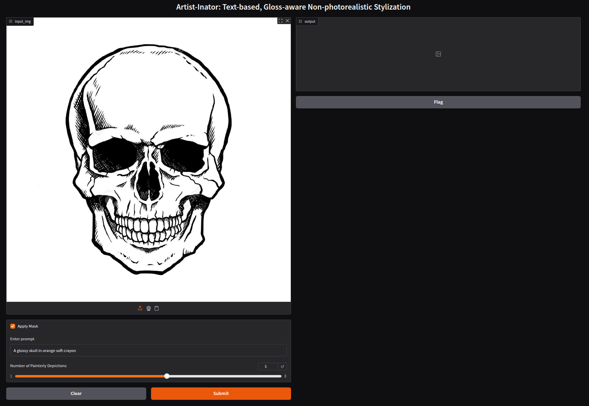

# Artist-Inator: Text-based, Gloss-aware Non-photorealistic Stylization

### [](https://graphics.unizar.es/projects/artist-inator_2025/) | [](https://graphics.unizar.es/papers/Subias2025ArtistInator.pdf) | [](https://nas-graphics.unizar.es/s/TSNcPw5mnm4PYFZ)

The official **Gradio**  implementation of [**Artist-Inator: Text-based, Gloss-aware Non-photorealistic Stylization**](https://graphics.unizar.es/projects/artist-inator_2025/). 

[J. Daniel Subias](https://dsubias.github.io/#about)<sup>1</sup>,
Saul Daniel-Soriano<sup>1</sup>,
[Diego Gutierrez](http://giga.cps.unizar.es/~diegog/)<sup>1</sup> and 
[Ana Serrano](https://ana-serrano.github.io/)<sup>1</sup>

<sup>1</sup>**Universidad de Zaragoza, I3A, Spain**

In **Eurographics Symposium on Rendering 2025** (Oral Presentation)


## TL;DR Quickstart

```
# Clone repository and enter in the folder
git clone git@github.com:dsubias/Artist-Inator.git
cd Artist-Inator

# Download pretrained model
bash download_model.sh

# Create a python environment
python -m venv artist-inator_env
source artist-inator_env/bin/activate
pip install -r requirements.txt

# Run the gradio app
python gradio_app.py

# Deactivate the python environment
deactivate
```

If everything works without errors, you should see an interface like this:




## Setup

Python 3 dependencies:

* [PyTorch 2.7.1](https://pytorch.org)
* [CUDA 12.4](https://developer.nvidia.com/cuda-downloads) 
* [Gradio 5.33.0](https://www.gradio.app)
* [Diffusers](https://github.com/huggingface/diffusers)

Download the pre-trained ControlNet model:

```
bash download_model.sh
```

We provide a requirements file including all of the above dependencies to create an environment. Create the python environment `artist-inator_env` by running:

```
python -m venv artist-inator_env
source artist-inator_env/bin/activate
pip install -r requirements.txt
```

## Cite

```
@article{10.1111:cgf.70182,
journal = {Computer Graphics Forum},
title = {{Artist-Inator: Text-based, Gloss-aware Non-photorealistic Stylization}},
author = {Subias, Jose Daniel and Daniel-Soriano, Saúl and Gutierrez, Diego and Serrano, Ana},
year = {2025},
publisher = {The Eurographics Association and John Wiley & Sons Ltd.},
ISSN = {1467-8659},
DOI = {10.1111/cgf.70182}
}
```

## Acknowledgements

This code refers to the following two projects:

[1] [StyLit, Ebsynth](https://github.com/jamriska/ebsynth) 

[2] [ControlNet, Diffusers](https://github.com/huggingface/diffusers)

This work was supported by the project PID2022-141539NB-I00, funded by MICIU/AEI/10.13039/501100011033 and by ERDF, EU; by the Government of Aragon’s Departamento de Ciencia, Universidad y Sociedad del Conocimiento through the Reference Research Group “Graphics and Imaging Lab” (ref. T34_23R); and by the Government of Aragon’s Departamento de Educación, Ciencia y Universidades through the project “HUMAN-VR: Development of a Computational Model for Virtual Reality Perception” (PROY_T25_24). J. Daniel Subias was supported by the CUS/702/2022 predoctoral grant. 

## Contact

    dsubias@unizar.es (Daniel Subías)

### Disclaimer:
The code from this repository is from a research project, under active development. Please use it with caution and contact us if you encounter any issue.

## License

This software is under GNU General Public License Version 3 (GPLv3), please see GNU License
For commercial purposes, please contact the authors.